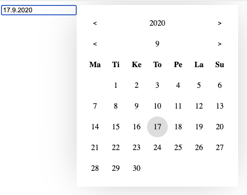

# oh wow, picker of much dates

### A datepicker that does not have features!

- why?
because all other datepickers are written with cobol and php with a touch of jquery wrapped within react container and offer a features ranging from selecting space ships to drawing furries...
- datepicker should only pick some dates



Uses `js-joda` for date models, because it works.

- Takes in a `LocalDate | null`, Outputs `LocalDate | null` how extraordinarily revolutional is that?
- One job, and one job only, select dates, how hard is that?
- Formatting only by js-joda `DateTimeFormatter`, only used for input display value read/write
- `valueFormatter` is the input value formatter and parser

## Such usage, oh wow

```tsx
import React, { useState } from 'react'

import { LocalDate } from 'js-joda'
import { WithDatepicker } from './lib'
import { datePickerConfig } from './lib/datepicker-config'

export function App() {
  const [state, setState] = useState<LocalDate | null>(LocalDate.now())
  return (
    <datePickerConfig.Provider value={{
      valueFormatter: DateTimeFormatter
      formatWeekday: (value: number) => React.ReactNode
      formatMonth: (value: LocalDate) => React.ReactNode
      formatYear: (value: LocalDate) => React.ReactNode
      formatDay: (value: LocalDate) => React.ReactNode

      monthSelectPrevBtnLabel: (value: LocalDate) => React.ReactNode
      monthSelectNextBtnLabel: (value: LocalDate) => React.ReactNode

      yearSelectPrevBtnLabel: (value: LocalDate) => React.ReactNode
      yearSelectNextBtnLabel: (value: LocalDate) => React.ReactNode


      closeAfterClick: boolean
    }}>
      <WithDatepicker value={state} onChange={setState} >
      {input => <input {...input} />}
      </WithDatepicker>
    </datePickerConfig.Provider>
  )
}
```

## FAQ
- why only hoc
  - do input yourself, maybe use whatever you please
- why does it look like sh...?
  - comrade do css self, nyet my problem. only minimal style provided.

## running locally
```
> yarn
> yarn start
```

## building lib
```
> yarn
> yarn build:lib
```

## much typescript

written in typescript. almost.
